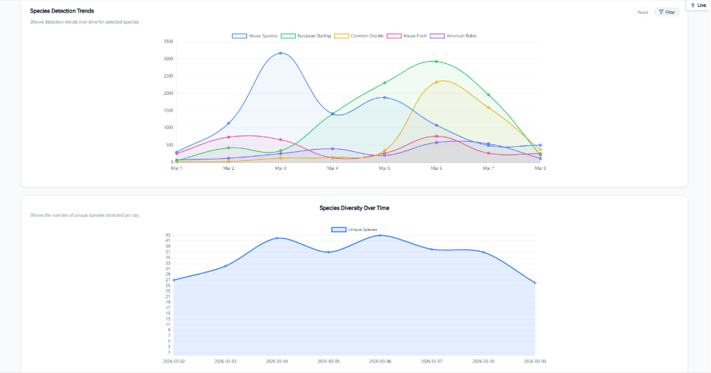
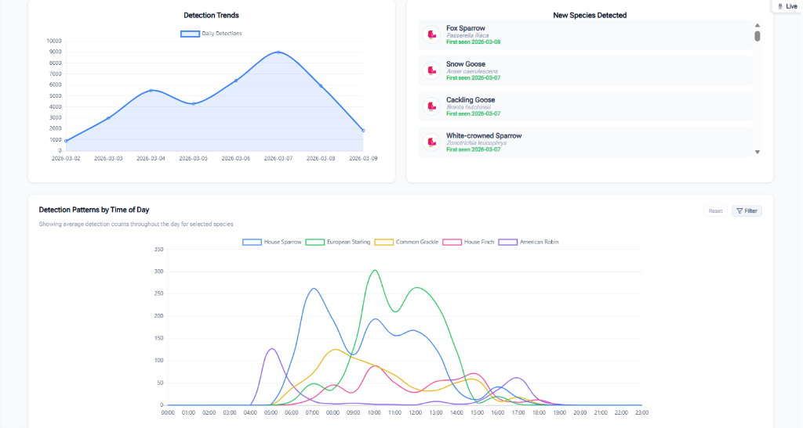

<div align="center">

# BirdNET-Pi Enhanced Version

### Turn your Raspberry Pi into an intelligent, 24/7 backyard bird observatory.

**BirdNET-Pi Enhanced** is a modern, actively maintained bird-monitoring platform that identifies
birds by sound in real time and turns every detection into something you can actually explore.

[](https://birdnet.cornell.edu/birdnet-pi/)
[](https://github.com/zach7036/BirdNET-Pi-Enhanced-Version/releases)
[](#requirements)
[](LICENSE)

[**Website**](https://zach7036.github.io/BirdNET-Pi-Enhanced-Version/) ·
[**Installation**](#installation) ·
[**Screenshots**](#screenshots) ·
[**Features**](#what-it-does) ·
[**Compare Versions**](https://zach7036.github.io/BirdNET-Pi-Enhanced-Version/compare.html) ·
[**Get Help**](https://github.com/zach7036/BirdNET-Pi-Enhanced-Version/discussions)


</div>

---

## More Than Bird Identification

Connect a USB microphone to your Raspberry Pi, and BirdNET-Pi Enhanced will continuously listen
for birds, identify species using the BirdNET machine learning framework, save the best
recordings, and organize everything into a modern web dashboard accessible from any device on
your network.

But identifying birds is only the beginning.

BirdNET-Pi Enhanced helps you understand the living patterns behind your detections: when the
dawn chorus begins, which species are active at night, how weather affects activity, which birds
are arriving or disappearing with the seasons, and how the biodiversity around your home changes
over time.

Any BirdNET-Pi will tell you a Northern Cardinal was heard at 6:14 a.m. with 87% confidence.
**This one is built around the question that comes next** — is that normal for this time of year,
has this bird been showing up daily or has it just returned after three weeks away, does it sing
earlier on warm mornings, and is 87% actually good enough to trust?

> [!TIP]
> **Choosing between BirdNET-Pi versions?**
> The official BirdNET guide lists this fork alongside [Nachtzuster's](https://github.com/Nachtzuster/BirdNET-Pi)
> under "Choose Your Version", and recommends it if you want a premium dashboard with visual
> analytics, weather integration, and detailed behavioral reports. Both share the same detection
> engine and identify birds equally well — the difference is what happens to your detections
> afterward.
> [BirdNET's version chooser →](https://birdnet.cornell.edu/birdnet-pi/) ·
> [Detailed side-by-side comparison →](https://zach7036.github.io/BirdNET-Pi-Enhanced-Version/compare.html)

## Highlights

- **Continuous bird monitoring** with automatic, real-time birdsong identification
- **Modern responsive interface** designed for desktop, tablet, and mobile devices
- **Interactive analytics** for species activity, diversity, detection trends, and time-of-day patterns
- **Live audio and spectrogram** for listening to and viewing your soundscape
- **Plain-English behavioral insights** including dawn chorus, nocturnal activity, rare visitors, seasonal presence, and migration changes
- **Weather-aware analysis** connecting temperature and conditions with bird activity
- **Species galleries and detail pages** with recordings, images, timelines, and detection history
- **Review tools** for verifying detections and comparing similar species
- **eBird checklist tools** for preparing and exporting observation data
- **BirdWeather integration** for contributing detections to the worldwide bird-monitoring network
- **Dark mode and a redesigned visual system** throughout the entire application
- **Automatic storage management, backups, restoration, notifications, and system-health tools**

## Contents

- [What it does](#what-it-does)
- [Screenshots](#screenshots)
- [Requirements](#requirements)
- [Installation](#installation)
- [First run](#first-run)
- [Configuration](#configuration)
- [Updating](#updating)
- [Backup and restore](#backup-and-restore)
- [Migrating from another fork](#migrating-from-another-fork)
- [REST API](#rest-api)
- [Troubleshooting](#troubleshooting)
- [Privacy](#privacy)
- [Contributing and support](#contributing-and-support)
- [Credits](#credits)
- [License](#license)

---

## What it does

### Today — the dashboard

The home screen answers "what's happening in the yard right now." It leads with the most recent
bird — photo, confidence, how long ago, how many times it's visited this week — followed by
**Today's Story**, which only speaks when something is genuinely unusual: a new species, a bird
returning after weeks away, a regular that has suddenly gone quiet, or a day notably busier or
quieter than your own two-week baseline.

Below that, every species detected today, as a grid of cards with individual hourly activity
charts or as a single heatmap of species against hours. Both carry the day's weather.


### Timeline — replay any day

Pick a date and see the whole day at once: species as horizontal lanes, visits as blocks along a
24-hour axis, weather across the top. Click any block to hear that recording. It's the fastest
way to understand the shape of a day — the dawn surge, the midday lull, the evening return.


### Charts — interactive analytics

Real Chart.js instances, not static images: hover for values, click legend entries to toggle
series, and they resize properly on a phone.

| Chart | Shows |
|---|---|
| Top 10 Species | Your most frequent visitors, ranked |
| Detections by Time of Day | Aggregate hourly activity across your history |
| Detection Trends | Daily detection volume over time |
| Species Diversity Over Time | Unique species per day |
| Species Detection Trends | Stacked comparison between species you choose |
| Detection Patterns by Time of Day | Overlaid hourly curves for selected species |
| New Species Detected | First-ever sightings, with dates |


### Insights — conclusions, not just charts

The Insights section reads your own database and states what it finds in plain English. It stays
quiet when there's nothing notable to say, so when it speaks it's worth reading.

- **Dashboard** — a **Yard Health Score** combining volume, stability, and rarity, plus lifetime
  milestones as you pass them and rare visitors worth a second look
- **Behavior** — your local **dawn chorus order**, which species are genuinely nocturnal, and the
  earliest and latest active windows for each bird
- **Migration** — **new arrivals** (first heard in the last fortnight), regulars that have **gone
  quiet**, peak weeks, and seasonal presence against expected frequency
- **Weather** — how temperature and conditions actually change activity at *your* station
- **Health** — confidence distribution and detection reliability over time
- **Trends & Forecasting** — long-term diversity including the **Shannon index**, with projections
- **Reports** — weekly, monthly, and yearly summaries, printable


### Review — verify what you're not sure about

BirdNET reports a confidence score, and scores in the middle of the range are genuinely
uncertain. The review queue collects those, groups them into **visits** rather than individual
detections, and gives you comparison clips of the same species from elsewhere in your history so
you can judge by ear.

Triage is keyboard-driven — <kbd>Y</kbd> confirm, <kbd>N</kbd> false positive, <kbd>U</kbd>
unsure, <kbd>H</kbd> hide, <kbd>R</kbd> reassign, <kbd>J</kbd>/<kbd>K</kbd> to move — and your
verdicts propagate. Detections marked as false positives are excluded from species counts,
insights, and eBird exports, so a misidentification doesn't quietly pollute your statistics
forever.


### Birds — a page per species

Every species gets a calendar heatmap of when you've heard it, its best recordings, full
detection history, and notes you can write yourself. Favorite species, mute ones you don't want
notifications for, and pin a favorite recording as the species' best. Each species' highest-
confidence clips are protected from automatic disk cleanup (how many is a setting, default 2),
a new higher-scoring clip takes over that protection automatically, and pinned clips are always
kept.


### Live — hear and see it happen

A live audio stream with a real-time scrolling spectrogram and detection labels, useful for
checking microphone placement and catching what the model misses. Gain, compression, and
frequency shift are adjustable, and there's a fullscreen kiosk mode.

### Weather, woven through

Hourly weather from [Open-Meteo](https://open-meteo.com/) is recorded alongside your detections
and appears wherever activity does — species charts, the timeline, the dashboard hero, and a
dedicated analysis page. **No API key and no plugin**: it starts automatically once your
coordinates are set, syncs hourly, and backfills up to seven days after an outage.

If you run [Home Assistant](https://www.home-assistant.io/), you can point the station at a
temperature entity and it will use your own garden reading instead of the regional forecast,
falling back to Open-Meteo if the sensor goes stale.

### Everything else

- **Year in Birds** — an annual summary with champions and monthly activity, downloadable as an image
- **eBird checklist export** — rebuilt, with a date picker for historical checklists, validation on eBird's required fields, and reviewed false positives automatically excluded
- **BirdWeather** — contribute detections to the worldwide network
- **Notifications** — 90+ platforms via [Apprise](https://github.com/caronc/apprise), grouped by visit rather than per detection, with quiet hours, rare-species alerts, per-species throttling, and weekly reports
- **Station Doctor** — health checks for the live stream, disk space, last detection, weather sync, local temperature sensor, location, and admin password, with one-click fixes
- **Installable on a phone** as a progressive web app, with a mobile tab bar
- **Command palette** — <kbd>Ctrl</kbd>+<kbd>K</kbd> to jump to any view or species
- **Dark mode** across every page, following your system preference
- **Your units** — Celsius or Fahrenheit, 12- or 24-hour time, number formats
- **37 languages** for species names
- **RTSP streams** as an audio source, in addition to a local microphone
- **Automatic disk management**, backup and restore, file manager, database maintenance, and a web terminal

---

## Screenshots

More of the interface. Every screen works on a phone as well as a desktop, and everything has a
proper dark theme.

**Species detection trends and diversity over time**



**Detection trends, new species, and time-of-day patterns**



**Seasonal presence — your detections against what's expected**


**Weather impacts, stated as conclusions**


**Year in Birds — an annual summary you can download and share**


**Station health at a glance**


---

## Requirements

| | |
|---|---|
| **Board** | Raspberry Pi 5, 4B, or 400 recommended. The 3B+ and Zero 2 W run detection but must use RaspiOS-ARM64-Lite, and the analytics and insights pages get slow as history accumulates. |
| **OS** | **64-bit** Raspberry Pi OS — please use **Trixie**. Lite is recommended; Full works. Get it from the [Raspberry Pi Imager](https://www.raspberrypi.com/software/). |
| **Audio** | Any USB microphone or USB sound card. Microphone quality affects results more than almost anything else. |
| **Storage** | A 32 GB or larger card. Old clips are purged automatically as space runs low. |

> [!WARNING]
> **A 32-bit OS will not work.** This is the most common installation failure by a wide margin.
> In Raspberry Pi Imager, expand "Raspberry Pi OS (other)" and pick an image that explicitly says
> *64-bit*. Verify on the Pi with `uname -m` — you want `aarch64`, not `armv7l`.

x86_64 is supported for developers and Linux-savvy users on Debian 12 or 13, with passwordless
`sudo` required.

## Installation

On a fresh 64-bit Raspberry Pi OS installation, this is the entire setup:

```bash
curl -s https://raw.githubusercontent.com/zach7036/BirdNET-Pi-Enhanced-Version/main/newinstaller.sh | bash
```

You can run it as the very first command on first boot — the installer handles all necessary
system updates itself. It writes a log to `$HOME/installation-$(date "+%F").txt`, which is the
first place to look if anything goes wrong.

Expect it to take a while and to look idle at points; compiling dependencies on a Pi is slow.

📖 **Read the complete installation guide before getting started:**
[step-by-step guide](https://zach7036.github.io/BirdNET-Pi-Enhanced-Version/install.html) ·
[project wiki](https://github.com/zach7036/BirdNET-Pi-Enhanced-Version/wiki)

> [!NOTE]
> Installing on top of an existing web server is **not supported** — BirdNET-Pi expects to own the
> web server configuration on the machine. Use a dedicated Pi, or open a
> [discussion](https://github.com/zach7036/BirdNET-Pi-Enhanced-Version/discussions) about your setup.

### New to Raspberry Pi?

If the process feels daunting, an AI assistant makes a capable setup guide. Paste this into
[Claude](https://claude.ai) to get oriented:

> Analyze this GitHub project and give me a detailed overview.
> https://github.com/zach7036/BirdNET-Pi-Enhanced-Version

Then follow up with your actual hardware, and describe any errors you hit as they happen:

> Give me a step-by-step guide to set this up. I have a [Raspberry Pi 5] and a
> [MAONO USB Lavalier Microphone].

## First run

Open the web interface from any browser on the same network:

- **`http://birdnetpi.local`** — or your Pi's IP address if that name doesn't resolve
- Username: **`birdnet`**
- Password: **empty by default**

The dashboard shows a setup checklist until the essentials are done. Two of them genuinely matter:

1. **Set your latitude and longitude** — *Settings → Settings → Location & Weather*. Without
   coordinates, species range filtering can't work and you'll get identifications for birds that
   don't occur near you. Weather and rarity detection depend on this too.
2. **Set an admin password** — *Settings → Settings → Advanced Settings*. Until you do, anyone on
   your network can change your station's configuration.

Then wait. Most stations get their first detection within minutes, and the insights pages become
genuinely interesting after a week or two of data.

> [!TIP]
> **Finding your way around Settings.** *Settings* in the sidebar opens a hub of tools — Station
> Doctor, System Controls, Services, eBird Export, species lists. The first button on it, also
> called *Settings*, is where the station's own options live. That's why paths below read
> *Settings → Settings*.

## Configuration

Everything is configurable from the web interface. The main sections under *Settings → Settings*:

| Section | Covers |
|---|---|
| Detection Model | Model choice, confidence threshold, sensitivity, overlap |
| Location & Weather | Latitude, longitude, and weather sync |
| Local temperature sensor | Optional Home Assistant temperature entity |
| Display & Units | Temperature, wind speed, time format, number format, site name |
| BirdWeather | Station ID for contributing to the network |
| Notifications | Apprise targets, triggers, quiet hours, visit grouping, weekly report |
| Privacy | Human-voice filtering, clip handling, what leaves your network |
| Species Images | Image provider (Wikipedia or Flickr) and API key |
| Language & Species Info | Species-name language and information source |
| Color scheme | Light, dark, or follow the system |

*Settings → Settings → Advanced Settings* holds the lower-level options: recording length,
extraction length, audio format, channels, RTSP streams, frequency shift, the human-voice
threshold, and **Disk Management** — whether a full disk purges old files or stops the services,
the purge threshold, and how many files to keep per species.

Species lists — custom, excluded, and whitelisted — are under *Settings* in the sidebar.

## Updating

From the web interface: **Settings → System Controls → Update**.

Releases are published on the [releases page](https://github.com/zach7036/BirdNET-Pi-Enhanced-Version/releases)
with notes on what changed. If an update seems not to have applied, save the output and open an issue.

## Backup and restore

From the web interface: **Settings → System Controls**, then *Backup data* or *Restore*. Copy the
resulting archive somewhere that isn't the Pi.

From the command line, assuming your backup medium is mounted at `/mnt`:

```bash
./scripts/backup_data.sh -a backup  -f /mnt/birds/backup-2026-07-27.tar
./scripts/backup_data.sh -a restore -f /mnt/birds/backup-2026-07-27.tar
```

Large collections take a long time in both directions. Let it finish.

## Migrating from another fork

Your detections, recordings, and settings carry across — the database schema is additive and the
`detections` table is never altered.

> [!IMPORTANT]
> **Back up first.** Restoring a backup is the supported way to return to your previous fork if
> you change your mind.

Make sure your current installation is fully up to date, then:

```bash
cd ~/BirdNET-Pi
git remote remove origin
git remote add origin https://github.com/zach7036/BirdNET-Pi-Enhanced-Version.git
./scripts/update_birdnet.sh
```

> [!WARNING]
> **Bullseye cannot be upgraded in place.** If you're on Bullseye, image a new card with a
> supported 64-bit OS, install fresh, and restore your backup with the Restore tool.

📖 **[Full migration guide](https://zach7036.github.io/BirdNET-Pi-Enhanced-Version/migrate.html)**

## REST API

Every screen is backed by a documented JSON API, so you can build your own dashboards, feed a
home automation system, or export your data. `GET` endpoints are read-only; list endpoints accept
`format=csv`.

```
GET  /api/v1/dashboard/now              Hero detection, today's totals, weather, services
GET  /api/v1/detections/recent          Recent detections
GET  /api/v1/detections/visits          Detections grouped into visits
GET  /api/v1/detections/timeline        A day's detections for replay
GET  /api/v1/species/list               Every species recorded
GET  /api/v1/species/search             Species search
GET  /api/v1/species/detail             One species in depth
GET  /api/v1/analytics/bundle           All analytics in one cached response
GET  /api/v1/analytics/{top_species|trends|patterns|diversity|activity|stats|detections|new_species}
GET  /api/v1/reviews/queue              Visits awaiting review
GET  /api/v1/reviews/examples           Comparison clips for a species
GET  /api/v1/weather/current            Current conditions
GET  /api/v1/station/doctor             Health checks
GET  /api/v1/system/health              Service status
GET  /api/v1/exports/ebird/preview      eBird checklist preview
GET  /api/v1/image/{sci_name}           Species image URL
GET  /api/v1/notes                      Notes
POST /api/v1/reviews                    Record a review verdict (fans out across the visit)
POST /api/v1/species/prefs              Favorite, mute, notify mode, crowned clip
POST /api/v1/notes                      Add a note
```

`POST` endpoints require basic authentication and an `X-Requested-With: XMLHttpRequest` header.

## Troubleshooting

Most odd behavior is fixed by **Settings → Services → Restart Core Services**. After that,
**Settings → Station Doctor** tests the recording and analysis services directly and offers
one-click fixes.

📖 **[Troubleshooting guide](https://zach7036.github.io/BirdNET-Pi-Enhanced-Version/troubleshooting.html)** — no detections, `birdnetpi.local` not loading, install failures, microphone problems, missing weather, false positives, and full disks.

Search the [issue tracker](https://github.com/zach7036/BirdNET-Pi-Enhanced-Version/issues) before
opening anything new. Use an **issue** for problems and a
[**discussion**](https://github.com/zach7036/BirdNET-Pi-Enhanced-Version/discussions) for ideas and
questions. When reporting a problem, include your Pi model, OS version, whether you installed
fresh or migrated, and the relevant log output.

## Privacy

BirdNET-Pi records audio around your home, so it ships with protections on by default:

- **Human-voice filtering** — when the model hears speech near a detection, that detection is discarded rather than saved
- **Only short clips are kept** — full recordings are deleted after analysis; only extracted detection clips remain
- **Local by default** — nothing leaves your network unless you enable an integration (BirdWeather, Apprise, weather sync, species images)

## Contributing and support

Issues and discussions are both welcome. If you find this project worth your time, consider
[making your installation public](https://github.com/mcguirepr89/BirdNET-Pi/wiki/Sharing-Your-BirdNET-Pi)
or joining [BirdWeather](https://app.birdweather.com).

Useful background from the original project's wiki, still largely applicable:

- [Some theory on classification, and practical hints](https://github.com/mcguirepr89/BirdNET-Pi/wiki/BirdNET-Pi:-some-theory-on-classification-&-some-practical-hints)
- [Adjusting your sound card](https://github.com/mcguirepr89/BirdNET-Pi/wiki/Adjusting-your-sound-card)
- [Suggested USB microphones](https://github.com/mcguirepr89/BirdNET-Pi/discussions/39)
- [Building your own microphone](https://github.com/DD4WH/SASS/wiki/Stereo--(Mono)-recording-low-noise-low-cost-system)

## Credits

BirdNET-Pi Enhanced builds upon the work of [Nachtzuster](https://github.com/Nachtzuster/BirdNET-Pi)
and original BirdNET-Pi creator [Patrick McGuire](https://github.com/mcguirepr89/BirdNET-Pi). This
version preserves BirdNET-Pi's proven core detection capabilities while introducing a
substantially redesigned interface, expanded analytics, weather-aware visualizations, improved
media and review tools, and an entirely new suite of behavioral and ecological insights.

Bird identification is powered by the [BirdNET framework](https://github.com/kahst/BirdNET-Analyzer)
by [@kahst](https://github.com/kahst), developed through a collaboration between the K. Lisa Yang
Center for Conservation Bioacoustics at the Cornell Lab of Ornithology and Chemnitz University of
Technology. Pre-built TFLite binaries by [@PINTO0309](https://github.com/PINTO0309). Species-name
localizations by [@patlevin](https://github.com/patlevin). The web interface is served by
[Caddy](https://caddyserver.com), with [Adminer](https://www.adminer.org/) for database
maintenance and [Apprise](https://github.com/caronc/apprise) for notifications.

### Elsewhere

- [PixCams build guide](https://pixcams.com/building-a-birdnet-pi-real-time-acoustic-bird-id-station/)
- [Core Electronics build article](https://core-electronics.com.au/projects/bird-calls-raspberry-pi)
- [Raspberry Pi blog post](https://www.raspberrypi.com/news/classify-birds-acoustically-with-birdnet-pi/)
- [MagPi issue 119 showcase](https://magpi.raspberrypi.com/issues/119/pdf)
- [Marie Lelouche's *Out of Spaces*](https://www.lestanneries.fr/exposition/marie-lelouche-out-of-spaces/), using BirdNET-Pi in VR

## License

> [!IMPORTANT]
> BirdNET-Pi and BirdNET-Lite are licensed under the **Creative Commons
> Attribution-NonCommercial-ShareAlike 4.0 International License**. Commercial use is not
> permitted under this license. Please [review the complete license](LICENSE) before using,
> modifying, or redistributing this project.
